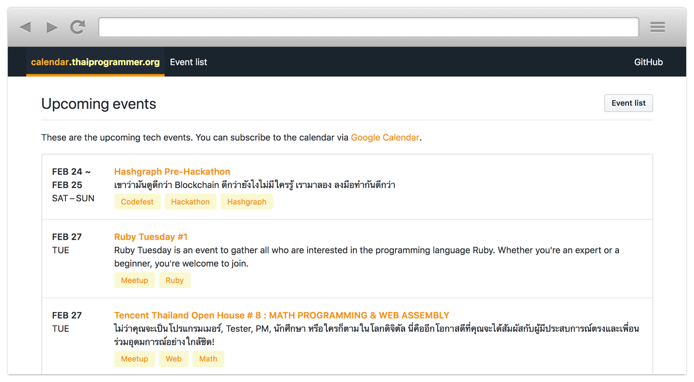

<strong>Thai</strong> &middot; <a href="README.en.md">English</a>

# ThaiProgrammer/tech-events-calendar

[**calendar.thaiprogrammer.org**](https://calendar.thaiprogrammer.org/) เป็นโปรเจกต์เพื่อรวบรวมข้อมูลของ Tech events ต่างๆ เพื่อให้ง่ายต่อการติดตาม ค้นหา และเพื่อส่งเสริมให้คนสาย Tech ในไทย ได้มาพบปะเจอกันมากขึ้น

โปรเจกต์นี้แบ่งเป็น 3 ส่วน:

1. โฟลเดอร์ [`data`](data) เก็บไฟล์ข้อมูลเกี่ยวกับ Tech event ต่างๆ
2. โฟลเดอร์ [`scripts`](scripts) และ [`lib`](lib) เก็บโค้ดสำหรับอ่านไฟล์ข้อมูลในข้อ 1 เพื่อสร้างเป็นไฟล์ [JSON](https://thaiprogrammer-tech-events-calendar.spacet.me/calendar.json) (สำหรับให้นักพัฒนาไปใช้ต่อ) และไฟล์ [ICS](https://thaiprogrammer-tech-events-calendar.spacet.me/calendar.ics) (เพื่อเชื่อมกับ [Google Calendar](https://calendar.google.com/calendar/embed?src=j5i0o6v2ihfboe19upl9lhonbci6ankr%40import.calendar.google.com&ctz=Asia%2FBangkok) ให้คนมากดติดตามได้ง่ายๆ)
3. โฟลเดอร์ [`website`](website) เก็บโค้ดสำหรับสร้างหน้าเว็บ [calendar.thaiprogrammer.org](https://calendar.thaiprogrammer.org/)

## หลักการและเหตุผล

ที่มาของโปรเจกต์นี้ เกิดจาก:

- มีคนถามผมเยอะมากว่า “ปกติตามพวกงาน Tech event ต่างๆ จากที่ไหน” ซึ่งปกติผมจะตามดูจากเฟสบุ๊ก และดูตาม Event platform ต่างๆ เช่น Meetup
- ข้อมูลพวกนี้ยังไม่มีใครรวมไว้ที่เดียว แต่เรามี Event platform หลายเจ้า ซึ่งแต่ละเจ้าก็มีแค่ข้อมูลของระบบตัวเอง ส่งผลให้หา Tech event ที่น่าสนใจยาก เนื่องจากข้อมูลกระจัดกระจาย

จึงเกิดเป็นโปรเจกต์นี้ขึ้นมา

## เทคโนโลยีที่ใช้

- **ไฟล์ข้อมูล** ในโฟลเดอร์ [data](data) เก็บเป็นไฟล์ภาษา [Markdown](https://en.wikipedia.org/wiki/Markdown) โดยเก็บข้อมูลเพิ่มเติมไว้ใน [YAML Front Matter](https://jekyllrb.com/docs/frontmatter/) ดู[รูปแบบการเก็บข้อมูลได้ที่หน้านี้](https://github.com/ThaiProgrammer/tech-events-calendar/blob/master/CONTRIBUTING.md#contributing-event-data)
- **สคริปต์เพื่อประมวลผลไฟล์ข้อมูล** เขียนด้วยภาษา JavaScript รันด้วย [Node.js](https://nodejs.org/en/)
- **เว็บไซต์** เขียนด้วย JavaScript โดยใช้เฟรมเวิร์ค [Vue](https://vuejs.org/) ในการสร้างหน้าเว็บ, [Vuex](https://vuex.vuejs.org/en/) สำหรับจัดการข้อมูล, [vue-router](https://router.vuejs.org/en/) สำหรับการจัดการ URL Routing และใช้ [Primer](https://primer.github.io/) เป็น CSS Framework

เพื่อให้โค้ดและข้อมูลในโปรเจกต์นี้มีข้อมูลที่ถูกรูปแบบอยู่เสมอ เราจึงมีการทำ [**Continuous integration**](http://www.somkiat.cc/imrpove-quality-with-continuous-integration/) ([อ่านเพิ่มเติม](http://www.notaboutcode.com/post/01-ci-journey/)) และ [**Continuous delivery**](http://www.somkiat.cc/continuous-delivery-and-devops-is-about-customer/) โดยในทุกๆ Commit เราจะมีการทดสอบโค้ดอัตโนมัติ ([Automated testing](http://go.spacet.me/tdd20160330)) ว่าทำงานถูกต้องหรือเปล่า รวมถึงมีการเช็ครูปแบบโค้ด ว่าเขียนตาม [JavaScript Standard Style](https://standardjs.com/) หรือไม่ เมื่อโค้ดผ่านการทดสอบทั้งหมด เราจะทำการ Deploy โค้ดขึ้นไปบนเว็บทันที โดยไม่ต้อง Deploy มือเลย

- เราใช้ [**CircleCI**](https://circleci.com/gh/ThaiProgrammer/tech-events-calendar) เพื่อทำการทดสอบโค้ดในทุกๆ Commit รวมถึงเวลามีคน Contribute โค้ดหรือข้อมูลใน Pull request ด้วย
- เราใช้ [**Netlify**](https://www.netlify.com/) เป็นเว็บโฮสติ้ง โดยที่ Netlify จะ Deploy เว็บให้โดยอัตโนมัติเมื่อโค้ดเข้า master branch นอกจากนี้ Netlify ยังมีฟีเจอร์ [Deploy previews](https://www.netlify.com/blog/2016/07/20/introducing-deploy-previews-in-netlify/) อีกด้วย ซึ่งเวลาเปิด Pull request ใน GitHub จะทำการ Deploy เป็น URL สำหรับการ Demo โดยเฉพาะให้ด้วย

## Development

โปรเจกต์นี้พัฒนาโดยอิงตาม [GitHub Flow](https://guides.github.com/introduction/flow/) (คนละอย่างกับ Git Flow นะ) โดยในส่วนนี้ จะ Assume [พื้นฐานเกี่ยวกับ Git และ GitHub](https://devahoy.com/posts/introduction-to-git-and-github/) และพื้นฐานเกี่ยวกับการใช้งาน Command Line และ Node.js เบื้องต้น

1. ติดตั้ง [Node.js](https://nodejs.org/en/) และ [Yarn](https://yarnpkg.com/en/) (เวอร์ชั่นล่าสุด)
2. ทำการโคลน Repository นี้
3. รันคำสั่ง `yarn install` เพื่อติดตั้งไลบรารี่ต่างๆ ที่จำเป็น

คำสั่งต่างๆ

- สั่ง `yarn build-json` เพื่อประมวลผลข้อมูล และสร้างเป็นไฟล์ JSON
- สั่ง `yarn dev` เพื่อเปิดเซิฟเวอร์สำหรับพัฒนาเว็บไซต์ โดยสามารถดูเว็บไซต์ได้ที่ http://localhost:8080

## Contributing

โปรเจกต์นี้ถูกพัฒนาโดย Community โดยคุณเองก็สามารถช่วยพัฒนาโปรเจกต์นี้ให้ไปข้างหน้าได้เช่นกัน โดยมีหลายช่องท่าง เช่น:

- กด Star ที่ Repo นี้
- แชร์และโปรโหมตเว็บ [calendar.thaiprogrammer.org](https://calendar.thaiprogrammer.org/) ให้เป็นที่รู้จักมากขึ้น ส่งโปรเจกต์นี้ให้เพื่อนดู ชวนกันมา Contribute ชวนเพื่อนไปงาน Event ต่างๆ
- [ส่งข้อมูลงาน Tech event ที่ยังไม่อยู่ในระบบ](https://github.com/ThaiProgrammer/tech-events-calendar/blob/master/CONTRIBUTING.md#missing-events)
- ช่วยแก้ไขข้อมูลที่ไม่ถูกต้อง โดยในหน้าเว็บ คุณสามารถกดปุ่ม “Edit on GitHub” เพื่อแก้ไขข้อมูลบน GitHub ได้เลย และส่ง Pull request มาให้เรา
- ช่วยเขียนคู่มือ เพื่อให้มือใหม่สามารถเข้ามาช่วยพัฒนาโปรเจกต์นี้ได้ง่ายขึ้น
- แก้บั๊ก หรือเพิ่มฟีเจอร์ต่างๆ
  - หากคุณไม่รู้จะช่วยตรงไหนดี [ลองดู Issue ที่แปะป้าย `help wanted`](https://github.com/ThaiProgrammer/tech-events-calendar/issues?q=is%3Aissue+is%3Aopen+sort%3Aupdated-desc+label%3A%22help+wanted%22)
  - สำหรับมือใหม่ แนะนำให้ดู Issue ที่มีป้าย [`good first issue`](https://github.com/ThaiProgrammer/tech-events-calendar/issues?q=is%3Aissue+is%3Aopen+sort%3Aupdated-desc+label%3A%22good+first+issue%22)
- สอนเพื่อนของคุณใช้งาน GitHub โดยให้ลองมาร่วมพัฒนาและปรับปรุงโปรเจกต์นี้
- รายงานบั๊ก เสนอไอเดียต่างๆ เพื่อให้โปรเจกต์นี้ดีขึ้น โดยสามารถสร้าง [Issue](https://github.com/ThaiProgrammer/tech-events-calendar/issues) ใน Repository นี้ (เขียนเป็นภาษาไทยได้)
